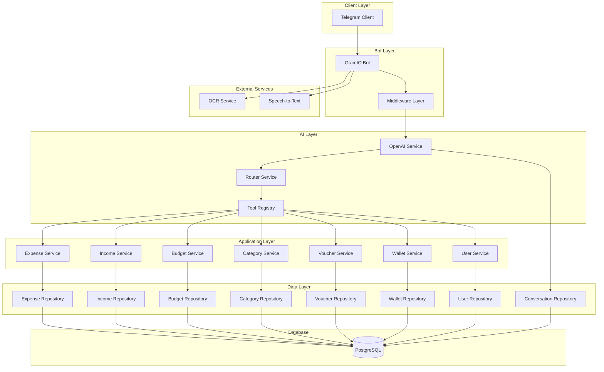

# Design Document

## Overview

The Telegram Budget Bot is a comprehensive personal finance management system designed for Indonesian users. The system leverages AI-powered natural language processing to provide an intuitive conversational interface for expense tracking, income management, budgeting, and financial insights. The bot supports multiple input methods (text, voice, receipt scanning) with a coin-based economy for premium features.

### Key Features
- Multi-modal input processing (text, voice, OCR)
- AI-powered automatic categorization and routing
- Coin-based economy for premium features
- Mathematical expression calculation
- Conversation history and context awareness
- Voucher redemption system
- Real-time budget monitoring and alerts

## Architecture

### High-Level Architecture



### Technology Stack
- **Runtime**: Bun (JavaScript runtime)
- **Language**: TypeScript
- **Validation**: Zod schemas
- **Bot Framework**: GramIO
- **Database**: PostgreSQL
- **ORM**: Prisma
- **AI**: OpenAI (configurable endpoint)
- **Architecture**: Repository/Service pattern

## Components and Interfaces

### Core Components

#### 1. GramIO Bot Handler
```typescript
interface BotHandler {
  handleTextMessage(message: TextMessage): Promise<void>
  handleVoiceMessage(voice: VoiceMessage): Promise<void>
  handlePhotoMessage(photo: PhotoMessage): Promise<void>
  handleCommand(command: Command): Promise<void>
}
```

#### 2. AI Router Service
```typescript
interface AIRouterService {
  routeMessage(message: string, context: ConversationContext): Promise<ToolCall>
  generateResponse(result: ToolResult, context: ConversationContext): Promise<string>
}

interface ToolCall {
  toolName: string
  parameters: Record<string, any>
}
```

#### 3. Tool Registry
```typescript
interface Tool {
  name: string
  description: string
  parameters: ZodSchema
  execute(params: any, userId: string): Promise<ToolResult>
}

interface ToolRegistry {
  registerTool(tool: Tool): void
  getTool(name: string): Tool | null
  listTools(): Tool[]
}
```

### Service Layer Interfaces

#### Expense Service
```typescript
interface ExpenseService {
  createExpense(data: CreateExpenseData): Promise<Expense>
  updateExpense(id: string, data: UpdateExpenseData): Promise<Expense>
  getExpensesByUser(userId: string, filters?: ExpenseFilters): Promise<Expense[]>
  deleteExpense(id: string): Promise<void>
  calculateTotal(expression: string): Promise<number>
}

interface CreateExpenseData {
  userId: string
  amount: number
  description: string
  categoryId?: string
  items?: ExpenseItem[]
  calculationExpression?: string
}
```

#### Income Service
```typescript
interface IncomeService {
  createIncome(data: CreateIncomeData): Promise<Income>
  updateIncome(id: string, data: UpdateIncomeData): Promise<Income>
  getIncomesByUser(userId: string, filters?: IncomeFilters): Promise<Income[]>
  deleteIncome(id: string): Promise<void>
}
```

#### Budget Service
```typescript
interface BudgetService {
  setBudget(data: SetBudgetData): Promise<Budget>
  getBudgetStatus(userId: string, categoryId?: string): Promise<BudgetStatus[]>
  checkBudgetAlerts(userId: string): Promise<BudgetAlert[]>
}

interface BudgetStatus {
  categoryId: string
  categoryName: string
  budgetAmount: number
  spentAmount: number
  percentage: number
  remainingAmount: number
}
```

#### Category Service
```typescript
interface CategoryService {
  getDefaultCategories(): Promise<Category[]>
  getUserCategories(userId: string): Promise<Category[]>
  createCategory(data: CreateCategoryData): Promise<Category>
  deleteCategory(id: string): Promise<void>
  categorizeTransaction(description: string): Promise<string>
}
```

#### Wallet Service
```typescript
interface WalletService {
  addBalance(userId: string, amount: number): Promise<Wallet>
  deductCoins(userId: string, amount: number): Promise<Wallet> // Supports float values (e.g., 0.5)
  getBalance(userId: string): Promise<Wallet>
  checkSufficientBalance(userId: string, requiredCoins: number): Promise<boolean>
}
```

#### Voucher Service
```typescript
interface VoucherService {
  redeemVoucher(code: string, userId: string): Promise<VoucherRedemption>
  validateVoucher(code: string): Promise<Voucher | null>
  markVoucherAsUsed(voucherId: string, userId: string): Promise<void>
}
```

### Repository Layer

#### Base Repository
```typescript
interface BaseRepository<T> {
  create(data: Partial<T>): Promise<T>
  findById(id: string): Promise<T | null>
  findMany(filters?: any): Promise<T[]>
  update(id: string, data: Partial<T>): Promise<T>
  delete(id: string): Promise<void>
}
```

### External Service Interfaces

#### OCR Service
```typescript
interface OCRService {
  extractReceiptData(imageBuffer: Buffer): Promise<ReceiptData>
}

interface ReceiptData {
  items: ReceiptItem[]
  total: number
  discount?: number
  tax?: number
  merchantName?: string
  date?: Date
}
```

#### Speech-to-Text Service
```typescript
interface STTService {
  transcribeAudio(audioBuffer: Buffer): Promise<string>
}
```

## Data Models

### Core Entities

#### User
```typescript
interface User {
  id: string
  telegramId: string
  username?: string
  firstName?: string
  lastName?: string
  language: string
  timezone: string
  createdAt: Date
  updatedAt: Date
}
```

#### Expense
```typescript
interface Expense {
  id: string
  userId: string
  amount: number
  description: string
  categoryId: string
  items?: ExpenseItem[]
  calculationExpression?: string
  receiptImageUrl?: string
  createdAt: Date
  updatedAt: Date
}

interface ExpenseItem {
  id: string
  expenseId: string
  name: string
  quantity: number
  unitPrice: number
  totalPrice: number
}
```

#### Income
```typescript
interface Income {
  id: string
  userId: string
  amount: number
  description: string
  categoryId: string
  createdAt: Date
  updatedAt: Date
}
```

#### Category
```typescript
interface Category {
  id: string
  name: string
  type: 'EXPENSE' | 'INCOME'
  isDefault: boolean
  userId?: string
  createdAt: Date
  updatedAt: Date
}
```

#### Budget
```typescript
interface Budget {
  id: string
  userId: string
  categoryId: string
  amount: number
  period: 'MONTHLY' | 'WEEKLY' | 'YEARLY'
  startDate: Date
  endDate: Date
  createdAt: Date
  updatedAt: Date
}
```

#### Wallet
```typescript
interface Wallet {
  id: string
  userId: string
  balance: number
  coins: number // Float to support fractional coins (e.g., 0.5 coins per transaction)
  createdAt: Date
  updatedAt: Date
}
```

#### Voucher
```typescript
interface Voucher {
  id: string
  code: string
  type: 'COINS' | 'BALANCE' | 'DISCOUNT'
  value: number
  isUsed: boolean
  usedBy?: string
  usedAt?: Date
  expiresAt?: Date
  createdAt: Date
  updatedAt: Date
}
```

#### Conversation
```typescript
interface Conversation {
  id: string
  userId: string
  message: string
  response: string
  messageType: 'TEXT' | 'VOICE' | 'PHOTO'
  toolUsed?: string
  coinsUsed?: number
  createdAt: Date
}
```

### Prisma Schema Structure
```prisma
model User {
  id          String   @id @default(cuid())
  telegramId  String   @unique
  username    String?
  firstName   String?
  lastName    String?
  language    String   @default("id")
  timezone    String   @default("Asia/Jakarta")
  createdAt   DateTime @default(now())
  updatedAt   DateTime @updatedAt
  
  expenses      Expense[]
  incomes       Income[]
  budgets       Budget[]
  categories    Category[]
  wallet        Wallet?
  conversations Conversation[]
  
  @@map("users")
}

model Expense {
  id                    String        @id @default(cuid())
  userId                String
  amount                Float
  description           String
  categoryId            String
  calculationExpression String?
  receiptImageUrl       String?
  createdAt             DateTime      @default(now())
  updatedAt             DateTime      @updatedAt
  
  user     User          @relation(fields: [userId], references: [id])
  category Category      @relation(fields: [categoryId], references: [id])
  items    ExpenseItem[]
  
  @@map("expenses")
}

model ExpenseItem {
  id         String  @id @default(cuid())
  expenseId  String
  name       String
  quantity   Int
  unitPrice  Float
  totalPrice Float
  
  expense Expense @relation(fields: [expenseId], references: [id])
  
  @@map("expense_items")
}
```

## Error Handling

### Error Types
```typescript
enum ErrorType {
  VALIDATION_ERROR = 'VALIDATION_ERROR',
  INSUFFICIENT_BALANCE = 'INSUFFICIENT_BALANCE',
  VOUCHER_INVALID = 'VOUCHER_INVALID',
  VOUCHER_ALREADY_USED = 'VOUCHER_ALREADY_USED',
  CATEGORY_NOT_FOUND = 'CATEGORY_NOT_FOUND',
  EXPENSE_NOT_FOUND = 'EXPENSE_NOT_FOUND',
  AI_SERVICE_ERROR = 'AI_SERVICE_ERROR',
  OCR_PROCESSING_ERROR = 'OCR_PROCESSING_ERROR',
  STT_PROCESSING_ERROR = 'STT_PROCESSING_ERROR'
}

interface AppError {
  type: ErrorType
  message: string
  details?: any
}
```

### Error Response Format
```typescript
interface ErrorResponse {
  success: false
  error: AppError
  userMessage: string // Localized message in Bahasa Indonesia
}
```

### Error Handling Strategy
1. **Validation Errors**: Use Zod schemas to validate all inputs
2. **Business Logic Errors**: Custom error classes for domain-specific errors
3. **External Service Errors**: Graceful degradation with fallback options
4. **User-Friendly Messages**: All errors translated to Bahasa Indonesia
5. **Logging**: Comprehensive error logging for debugging

## Testing Strategy

### Unit Testing
- **Services**: Test business logic with mocked repositories
- **Repositories**: Test data access with test database
- **Tools**: Test AI tool execution with mocked dependencies
- **Utilities**: Test calculation and validation functions

### Integration Testing
- **API Endpoints**: Test complete request/response cycles
- **Database Operations**: Test with real PostgreSQL test database
- **External Services**: Test with mocked OCR and STT services
- **AI Integration**: Test with mocked OpenAI responses

### End-to-End Testing
- **Bot Interactions**: Simulate complete user conversations
- **Multi-modal Input**: Test text, voice, and image processing flows
- **Business Workflows**: Test expense creation, budget alerts, voucher redemption

### Testing Tools
- **Test Runner**: Bun test
- **Mocking**: Built-in Bun mocking capabilities
- **Database**: Separate test database with Prisma migrations
- **Assertions**: Custom assertion helpers for domain objects

### Test Data Management
- **Fixtures**: Predefined test data for consistent testing
- **Factories**: Dynamic test data generation
- **Cleanup**: Automatic test data cleanup between tests
- **Seeding**: Default categories and test users

## Group Functionality Considerations

### Group vs Private Chat Design

The bot is designed primarily for individual financial management, but group functionality presents interesting opportunities and challenges:

#### Potential Group Use Cases
1. **Family Budget Management**: Shared family expenses and budgets
2. **Roommate Expense Splitting**: Shared household costs
3. **Team/Office Expenses**: Small team expense 

### Database Optimization
- **Indexing**: Strategic indexes on frequently queried fields
- **Connection Pooling**: Prisma connection pooling configuration
- **Query Optimization**: Efficient queries with proper relations
- **Pagination**: Implement pagination for large result sets

### Caching Strategy
- **In-Memory Cache**: Cache frequently accessed categories and user preferences
- **Conversation Context**: Cache recent conversation history for AI context
- **Rate Limiting**: Implement rate limiting for expensive operations

### AI Service Optimization
- **Request Batching**: Batch multiple AI requests when possible
- **Response Caching**: Cache AI responses for identical inputs
- **Fallback Strategies**: Graceful degradation when AI services are unavailable
- **Cost Management**: Monitor and optimize AI usage costs

### Scalability Considerations
- **Horizontal Scaling**: Design for multiple bot instances
- **Database Sharding**: Plan for user-based sharding if needed
- **Queue System**: Implement job queues for heavy processing tasks
- **Monitoring**: Comprehensive monitoring and alerting
#
# Group Functionality Considerations

### Group vs Private Chat Design

The bot is designed primarily for individual financial management, but group functionality presents interesting opportunities and challenges:

#### Potential Group Use Cases
1. **Family Budget Management**: Shared family expenses and budgets
2. **Roommate Expense Splitting**: Shared household costs
3. **Team/Office Expenses**: Small team expense tracking
4. **Travel Groups**: Shared vacation or trip expenses

#### Coin System in Groups - Design Options

**Option 1: Individual Coin Deduction**
- Each user pays their own coins for premium features
- When someone uses voice/OCR in group, only their coins are deducted
- Pros: Fair individual cost, simple implementation
- Cons: May discourage usage if only one person has coins

**Option 2: Shared Group Wallet**
- Group has a collective coin pool that members can contribute to
- Premium features deduct from group wallet
- Pros: Encourages group participation, shared cost
- Cons: Complex permission management, potential conflicts

**Option 3: Hybrid Approach**
- Try individual coins first, fallback to group wallet if available
- Group admin can set policies (e.g., "group pays for receipts")
- Pros: Flexible, accommodates different group dynamics
- Cons: Most complex to implement

#### Recommended Group Implementation Strategy

**Phase 1: Individual-First Design**
```typescript
interface GroupContext {
  chatId: string
  chatType: 'private' | 'group' | 'supergroup'
  userId: string // The user who triggered the action
  groupSettings?: GroupSettings
}

interface GroupSettings {
  id: string
  chatId: string
  allowSharedExpenses: boolean
  defaultSplitMethod: 'EQUAL' | 'CUSTOM' | 'BY_INCOME'
  coinPaymentMethod: 'INDIVIDUAL' | 'GROUP_WALLET' | 'HYBRID'
  adminUserIds: string[]
}
```

**Group-Specific Features to Consider:**
1. **Expense Attribution**: "Siapa yang beli kopi ini?" - AI asks for clarification
2. **Split Calculations**: Automatic expense splitting among group members
3. **Group Budgets**: Shared budgets for common expenses
4. **Permission System**: Group admins can manage settings
5. **Notification Control**: Users can opt-in/out of group notifications

#### Group Data Models

```typescript
interface GroupExpense extends Expense {
  groupChatId: string
  paidBy: string // User who paid
  splitAmong: ExpenseSplit[]
  isSharedExpense: boolean
}

interface ExpenseSplit {
  userId: string
  amount: number
  percentage?: number
  isPaid: boolean
}

interface GroupWallet {
  id: string
  groupChatId: string
  totalCoins: number
  contributions: GroupWalletContribution[]
  createdAt: Date
  updatedAt: Date
}

interface GroupWalletContribution {
  id: string
  groupWalletId: string
  userId: string
  coinsContributed: number
  createdAt: Date
}
```

#### Group Coin Usage Recommendations

For your consideration, I recommend **Option 1 (Individual Coin Deduction)** for the initial implementation because:

1. **Simplicity**: Easier to implement and understand
2. **Fairness**: Each person pays for their own premium usage
3. **Privacy**: Individual financial data remains separate
4. **Scalability**: Works regardless of group size

**Implementation Details:**
- When user uses voice/OCR in group: deduct from their personal coins
- If insufficient coins: private message suggesting to add balance
- Group members can see the expense result, but coin deduction is individual
- Future enhancement: allow voluntary coin sharing/gifting between users

This approach maintains the individual-focused design while enabling group collaboration without complex shared wallet management.
